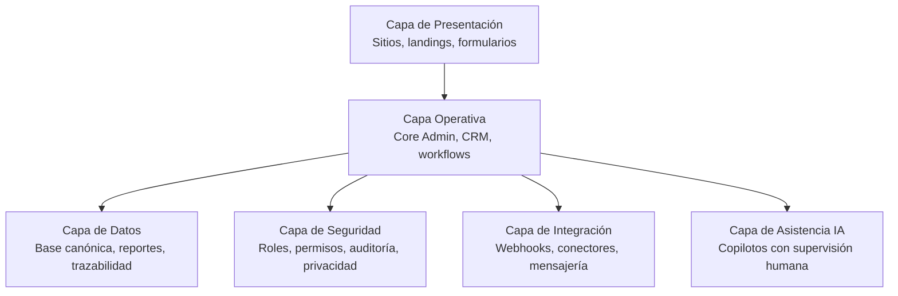
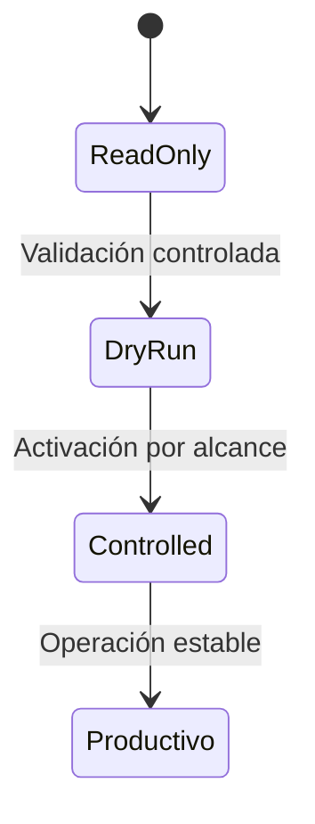
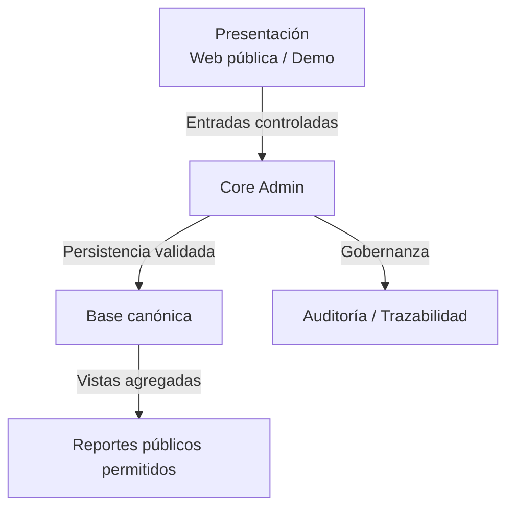

# Diagramas base (material visual mínimo)

Este documento reúne diagramas **conceptuales** para demo comercial y técnica sin exponer datos reales.

> Alcance: no incluye PDFs, no usa capturas de producción y no contiene PII, credenciales ni URLs privadas.

## 1) Flujo operativo ideal

```mermaid
flowchart LR
    A[Adquisición de lead] --> B[Landing / Form público]
    B --> C[Validación inicial]
    C --> D[CRM / Core Admin]
    D --> E[Clasificación y prioridad]
    E --> F[Automatizaciones y notificaciones]
    F --> G[Seguimiento comercial]
    G --> H[Conversión / cierre]
    H --> I[Onboarding]
    I --> J[Analítica y mejora continua]
```

## 2) Capas del ecosistema

## 3) Estados de módulo (madurez)

## 4) Relación: Presentación, Core Admin y Base canónica

## Uso recomendado en demo

- Mostrar primero el flujo operativo ideal para contexto de negocio.
- Luego explicar capas para ubicar responsabilidades técnicas.
- Alinear expectativas con estados de madurez antes de prometer alcance.
- Cerrar con la relación Presentación–Core Admin–Base canónica para reforzar control y trazabilidad.
